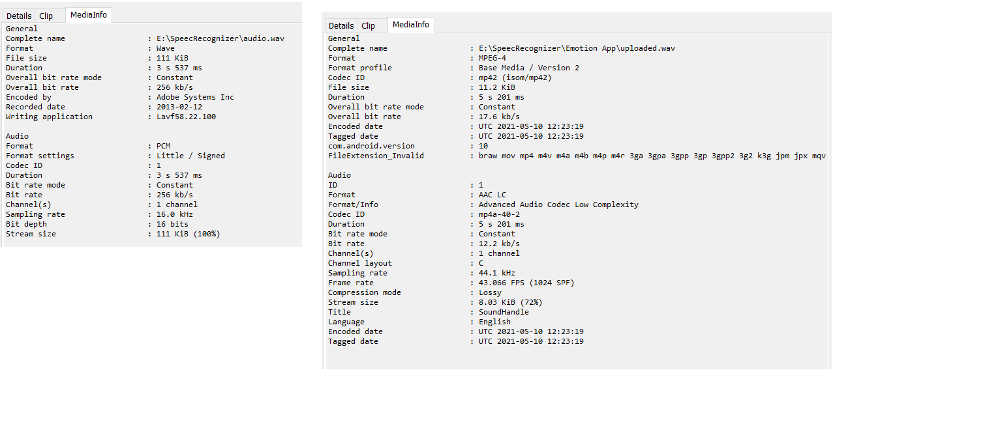

# emotion-android

_Note: The `SoundRecorder` class uses `MediaRecorder API` that was in use before but can be safely deleted_

## Working of the Audio Recorder
`MediaRecorder API` makes audio recording easier but doesn't give full access on how to write the audio file. For that reason I implemented my own AudioRecorder.

On the left we have the required mp3 format that is acceptable by the model and on the write an audio file format generated by `MediaRecorder` API.

The implementation of `AudioRecorder` is already described in comments where necessary in the `AudioRecorder.kt` but here are some details.

1. After the audio is recorded I generate meta data and embed it in the file so the audio can be opend by any audio player. The reason I generate meta data at the end of recording is because we don't know the audio length (length of bytes) at first.
2. The meta data is as per the screenshot with following encodings:

    | Description      | Value |
    | ----------- | ----------- |
    | Sampling Rate      | 16000 (16kHz) |
    | Channels (Mono)    | 1        |
    | Bit rate           | 256 kb/s       |
    | Bit depth          | 16 bits     |
    
    
    ___Note:__ Recording files are almost similar important part is how you generate a meta data for the file. Because a player first extracts meta data from the audio file to check how to read the bytes from the audio file._
